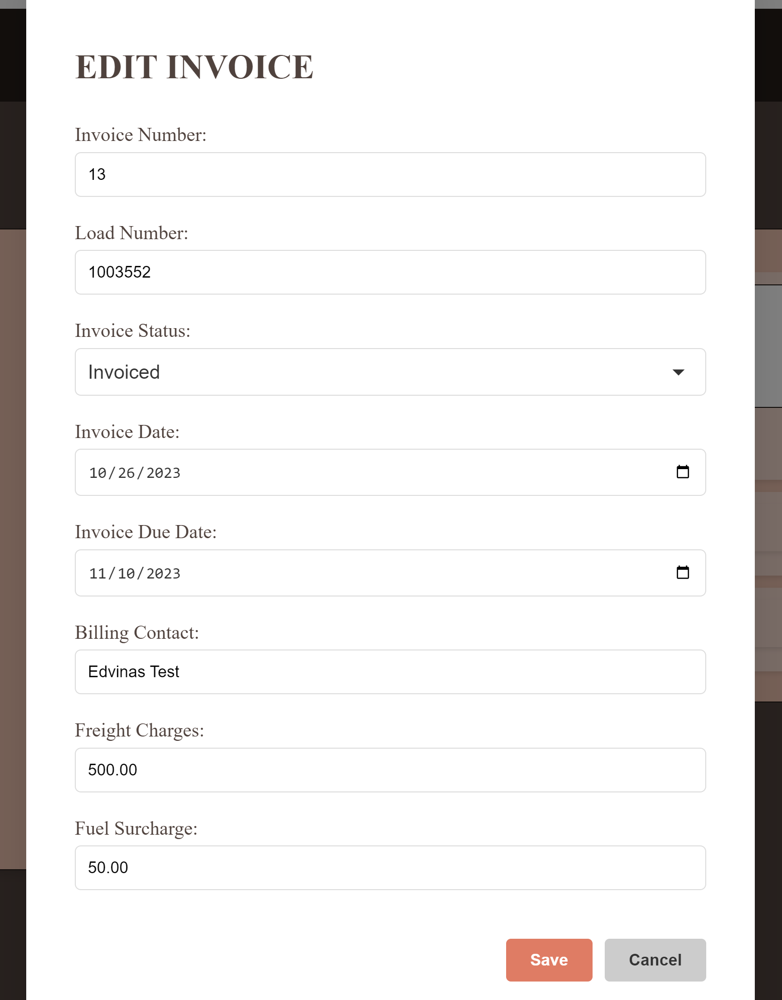
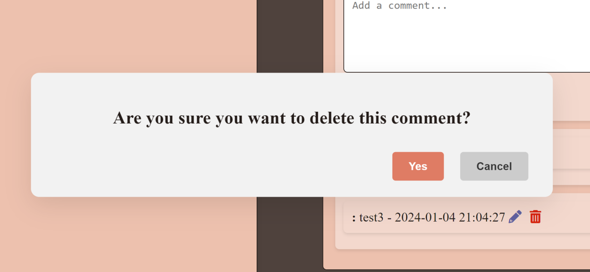

{width="4.291666666666667in" height="2.4125in"}

> INFORMATIKOS FAKULTETAS
>
> **T120B165** **Saityno** **taikomųjų** **programų** **projektavimas**
>
> **Projekto** **„Customer** **Portal"** **ataskaita**
>
> Studentas:
>
> Dėstytojas:

Edvinas Richteris, IFF-0/5

> Tomas Blažauskas
>
> KAUNAS 2017

Turinys

1\. Sprendžiamo uždavinio
aprašymas\...\...\...\...\...\...\...\...\...\...\...\...\...\...\...\...\...\...\...\...\...\...\...\...\...\...\...\...\...\...\...\...\...\....3

> 1.1. Sistemos
> paskirtis\...\...\...\...\...\...\...\...\...\...\...\...\...\...\...\...\...\...\...\...\...\...\...\...\...\...\...\...\...\...\...\...\...\...\...\...\...\...\...\.....3
>
> 1.2. Funkciniai
> reikalavimai\...\...\...\...\...\...\...\...\...\...\...\...\...\...\...\...\...\...\...\...\...\...\...\...\...\...\...\...\...\...\...\...\...\...\...\...\.....3

2\. Sistemos
architektūra\...\...\...\...\...\...\...\...\...\...\...\...\...\...\...\...\...\...\...\...\...\...\...\...\...\...\...\...\...\...\...\...\...\...\...\...\...\...\...\...\....4

3\. API
specifikacija\...\...\...\...\...\...\...\...\...\...\...\...\...\...\...\...\...\...\...\...\...\...\...\...\...\...\...\...\...\...\...\...\...\...\...\...\...\...\...\...\...\...\.....5

> 3.1. Krovinių API
> metodai\...\...\...\...\...\...\...\...\...\...\...\...\...\...\...\...\...\...\...\...\...\...\...\...\...\...\...\...\...\...\...\...\...\...\...\...\...\....5
>
> 3.2. Sąskaitų API
> metodai\...\...\...\...\...\...\...\...\...\...\...\...\...\...\...\...\...\...\...\...\...\...\...\...\...\...\...\...\...\...\...\...\...\...\...\...\...\.....7
>
> 3.3. Komentarų API
> metodai\...\...\...\...\...\...\...\...\...\...\...\...\...\...\...\...\...\...\...\...\...\...\...\...\...\...\...\...\...\...\...\...\...\...\...\....10

4\. Sistemos naudotojo
sąsaja\...\...\...\...\...\...\...\...\...\...\...\...\...\...\...\...\...\...\...\...\...\...\...\...\...\...\...\...\...\...\...\...\...\...\...\...\...\....13

1\. Sprendžiamo uždavinio aprašymas

> 1.1.Sistemos paskirtis
>
> Projekto tikslas -- sukurti klientų portalą, kuriame prisijungę
> klientai galėtų matyti savo vežamus, bei jau pristatytus krovinius,
> laukiamas apmokėjimo ir jau apmokėtas sąskaitas, taip pat galėtų
> palikti komentarus po sąskaitomis su kurių sumomis nesutinka. Sistema
> turi būti saugi, lengvai naudojama bei sklandžiai veikianti.
>
> Veikimo principas -- pačią kuriamą platformą sudaro dvi dalys:
> internetinė aplikacija, kuria naudosis klientai ir administratoriai,
> bei aplikacijų programavimo sąsaja (angl. trump. API).
>
> Svečias (įmonės klientas, kuris dar nėra prisiregistravęs) galės
> registruotis prie internetinės aplikacijos, tačiau negalės naudotis
> sistema, kol to nepatvirtins administratorius. Administratoriui
> patvirtinus registraciją, klientas galės stebėti savo vežamus bei
> pristatytus krovinius, prisegti dokumentus, kurti naujus krovinius,
> parašyti komentarus po jais jeigu nesutiks su esama informacija
> sistemoje. Taip pat galės matyti apmokėtas bei neapmokėtas sąskaitas
> bei pranešimus, jei laiku nesumokės sąskaitų. Administratorius galės
> matyti visų klientų kompanijų krovinius bei sąskaitas, taip pat galės
> valdyti naudotojus.
>
> 1.2. Funkciniai reikalavimai

**Neregistruotas** **sistemos** **naudotojas** **galės**:

> 1\. Peržiūrėti platformos reprezentacinį puslapį; 2. Prisiregistruoti
> prie internetinės aplikacijos;

**Registruotas** **sistemos** **naudotojas** **galės**: 1. Prisijungti
prie platformos.

> 2\. Peržiūrėti savo krovinius. 3. Sukurti krovinį.
>
> 4\. Siųsti pranešimą apie trūkstamą dokumentą (neįkeltas iš įmonės
> pusės) 5. Palikti komentarus po kroviniais.
>
> 6\. Peržiūrėti savo apmokėtas bei neapmokėtas sąskaitas.

**Administratorius** **galės**:

> 1\. Patvirtinti naudotojo registraciją. 2. Šalinti naudotojus.
>
> 3\. Redaguoti krovinius bei sąskaitas.
>
> 4\. Siųsti pranešimą klientui dėl vėluojamos apmokėti sąskaitos.

2\. Sistemos architektūra

> Sistemos sudedamosios dalys:
>
> • Kliento pusė (ang. Front-End) -- naudojant Vue.js;
>
> • Serverio pusė (angl. Back-End) -- naudojant PHP Laravel. Duomenų
> bazė -- MySQL.
>
> Internetinė aplikacija yra pasiekiama per HTTPS protokolą. Šios
> sistemos veikimui (pvz.,
>
> {width="6.5in"
> height="3.321527777777778in"}duomenų manipuliavimui su duomenų baze)
> yra reikalingas CustomerPortal API, kuris pasiekiamas per aplikacijų
> programavimo sąsają. Pats CustomerPortal API vykdo duomenų mainus su
> duomenų baze - tam naudojama ORM sąsaja.

3\. API specifikacija

Tam, kad būtų išlaikomas nuoseklumas, sistemos API metodai bus aprašomi
lentelėmis (žr. 1 lentelę). Jose pateikiama svarbiausia bei būtina
informacija sėkmingam užklausos vykdymui. Taip pat pateikiama
informacija apie galimas klaidas, kurios gali iškilti apdorojant tam
tikrą API užklausą. Verta paminėti, kad kelias iki metodo yra nurodomas
tik parašant URL galutinę dalį, nes domenas, akivaizdu, gali skirtis.

> 3.1.Krovinių API metodai
>
> *1* *lentelė.* *Loads* *Get* *(GET)* *specifikacija*

> *2* *lentelė.* *Load* *Get* *(GET)* *specifikacija*

> 3.2.Sąskaitų API metodai
>
> *3* *lentelė.* *Invoices* *All* *(GET)* *specifikacija*

> *4* *lentelė.* *Invoice* *Get* *(GET)* *specifikacija*

> *5* *lentelė.* *Invoice* *edit* *(PUT)* *specifikacija*

> *6* *lentelė.* *Invoice* *delete* *(DEL)* *specifikacija*

> 3.3.Komentarų API metodai
>
> *7* *lentelė.* *Comments* *All* *(GET)* *specifikacija*

> *8* *lentelė.* *Comment* *edit* *(PUT)* *specifikacija*

> *9* *lentelė.* *Comment* *delete* *(DEL)* *specifikacija*

4\. Sistemos naudotojo sąsaja

> {width="6.5in"
> height="3.529861111111111in"}**Prezentacinis** **puslapis**

{width="6.5in" height="3.4902766841644794in"}

> **Prisijungimo** **forma**
>
> {width="6.5in"
> height="3.5305555555555554in"}**Krovinių** **sąrašas**
>
> {width="6.5in"
> height="3.5249989063867018in"}**Krovinio** **informacija**
>
> {width="6.5in"
> height="6.269443350831146in"}**Krovinio** **redagavimo** **modalas**
>
> {width="6.5in"
> height="4.806248906386702in"}**Krovinio** **ištrynimo** **modalas**
>
> {width="6.5in"
> height="3.5138877952755907in"}**Sąskaitos** **informacijos/Sąskaitos**
> **komentarų** **langas**
>
> {width="6.5in"
> height="8.305555555555555in"}**Sąskaitos** **redagavimo** **modalas**
>
> {width="6.5in"
> height="4.2965277777777775in"}**Sąskaitos** **ištrinimo** **modalas**

{width="5.620833333333334in"
height="4.070833333333334in"}

> **Komentarų** **redagavimo** **modalas**
>
> {width="6.5in" height="3.0in"}**Komentarų**
> **ištrinimo** **modalas**
